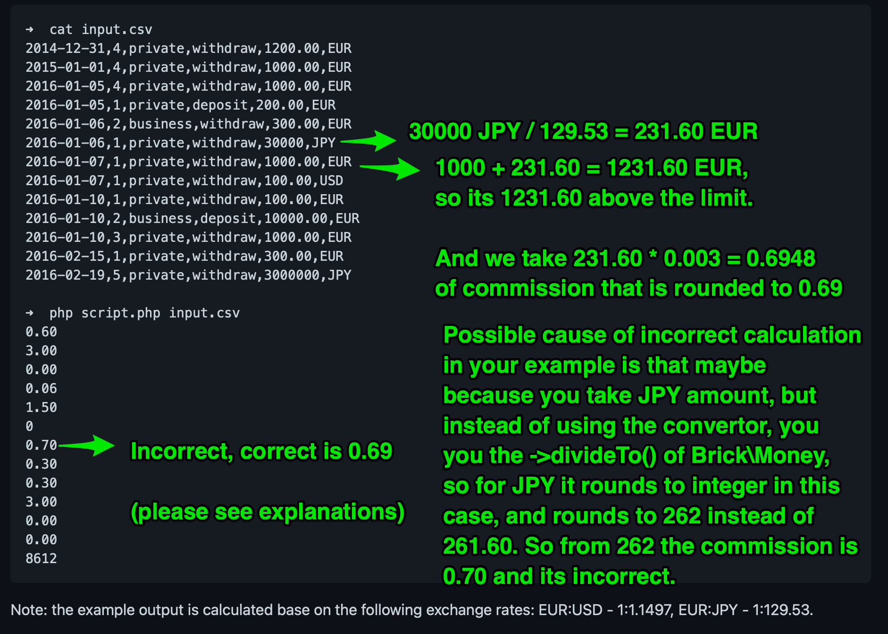

# Commissions Calculator (IN PROGRESS)

Given:

 - There is a list of transactions in CSV file, see [example](https://github.com/dnegometyanov/commissions-calculator/blob/master/src/InputData/input.csv)
 - And exchanges rates are provided by [api.exchangeratesapi.io](https://api.exchangeratesapi.io/latest)
 - And there are following types of user: `private` and `business`
 - And there are following types of transactions `deposit` and `witdrawal`
 - And `withdrawal` + `business` transactions commissions are calculated with flat percentage rate of `0.5%`
 - And `deposit` + (both `private` and  `business`)  transactions commissions are calculated with flat percentage rate of `0.03%`
 - And `withdrawal` + (`private`) are free if weekly (Mon-Sun) total amount of these type of transactions is less then `EUR 1000`
    according to `api.exchangeratesapi.io` and at the same time less or equal then `3` transactions of this type per week. 
    In other case, the part of transaction that exceeds the above threshold conditions has commission of `0.3%`
 - The rates above should be adjustable from the config without code changes, 
   as well there should be a possibility to add new rules with entire new logic without existing code modifications.   

Expected:
 - Console command should take the csv filename as input and output commission amount without currency as output.   
 - Example of commissions calculation provided on the screenshot below, but **it has an error**

**Please note, that expected example provided is incorrect !**

## Prerequisites

This project has DEV-env configs for Docker and Make utility,
so Docker should take care of proper local environment independently of you local config 
and Makefile has useful commands right in the repo.

Commands from Makefile could be executed manually in case Make utility is not installed.

As well as in case docker is not installed, you will need at least Php 7.4 with bcmath to run the app
and you may check Dockerfile for troubleshooting of your local config. 

## Architecture explanations
 - We have the following domain entities: `Transaction` and its `User` dependency. 
   As well as `TransactionType` and `UserType` value objects.
   
 - Most of the core calculation logic is in `Commissions\CalculatorContext\Domain\Service\CommissionsCalculator\Rules` namespace.
Each rule implements `RuleInterface` and basically takes  `Transaction`, `UserCalculationStateCollection`, `ExchangeRates` 
   as parameters for calculation of commission of each transaction. 

 - Rules are configured to the `RuleSequence`, so the first matching rule applies to calculate the commission. 
   I have not used the chain of responsibility here, so Rules are standalone from the sequence and do not have redundant chain responsibility.  

 - `UserCalculationStateCollection` is a collection the has Transaction Type (i.e. `deposit` or `withdrawal`) as a key,
   and `UserCalculationState` as value. For now `UserCalculationState` contains aggregation of Weekly Amount per transaction type and weekly transactions count per transaction type.
   TODOs : I need to make `UserCalculationState` extendable for new types of rules,
   but not only weekly amount and transactions count.

- `UserCalculationStateRepositoryInterface` is an interface for storing and retrieving `UserCalculationStateCollection` per user id.
And `UserCalculationStateRepositoryDefault` is its in-memory implementation.
  
 - `CommissionCalculator` implements `CommissionCalculatorInterface`
   and finds proper calculation rule from `RulesSequence` using Rule's `isSuitable` condition.

## Build container and install composer dependencies

    Make build

## Build container and install composer dependencies

If dist files are not copied to actual destination, then
    
    Make copy-dist-configs
        
## Run application

Runs container and executes console application with default `input.csv` parameter.

    Make run

In case you need to execute it with another input filename parameter, you can use
    
    docker-compose run --rm --no-deps php-cli php src/index.php input.csv

and change the filename accordingly

## Run tests

Runs container and executes proper tests (Unit / Integration / All respectively).

    Make unit-tests

    Make integration-tests

    Make all-tests

## Static analysis

Static analysis check

    Make static-analysis
    
## Fix code style

    Make cs-fix